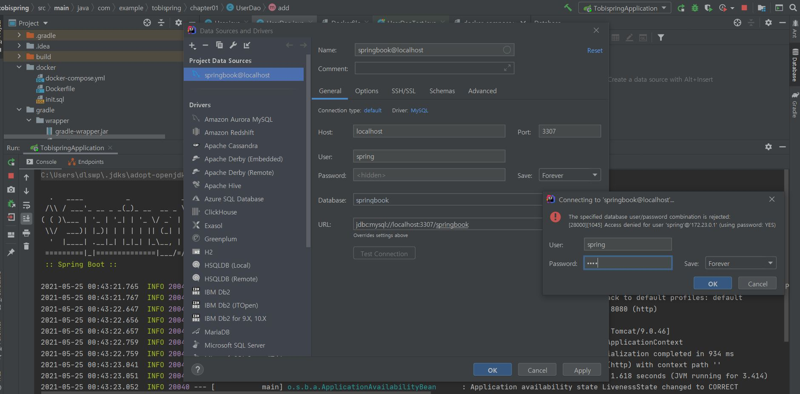
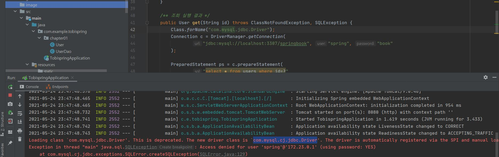

### 토비의 스프링 스터디

## Docker로 mysql DB 띄우기
* 각자 OS에 맞는 Docker 를 설치한다.

* (windows 기준으로) Docker 설치후 CMD창에 아래와 같은 결과가 나오면 docker가 정상 설치가 된거임.

* 프로젝트 루트 디렉터리에서 아래 명령어 실행 
> cd docker
> docker-compose up -d

### Intellij에서 Database 서버모드 조회

### 기타...

* Warning이긴 하지만, chapter 1에서 쓰는 mysql driver가 deprecated가 되어 다른 드라이버로 대체
    * 콘솔에 빨간줄은 다른 에러로 인해 생긴 부분입니다.
