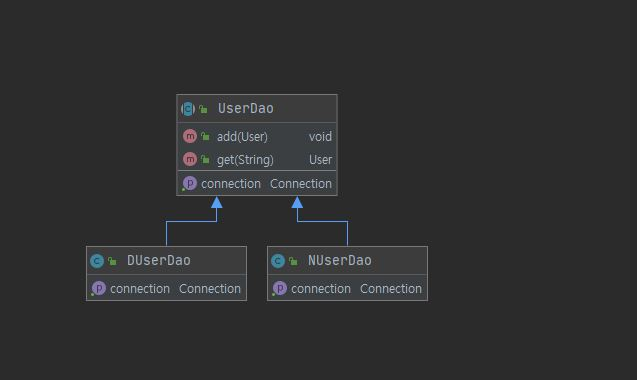

> Written with [StackEdit](https://stackedit.io/).

# 1장 : 오브젝트와 의존관계

---

* 초난감 UserDao를 리팩토링 하며,  객체지향 사상에 바람직한 방법을 탐구해보는 방식으로 예제가 진행이 된다.

* ~~사실상 1장은 책 제목이 스프링이라고 했지만 스프링 보다 객체지향 프로그래밍에 대한 개념설명이 주를 이루고 있습니다.~~

---

### 1.1 초난감 DAO

```java
public class User {  
    private String id;  
 private String name;  
 private String password;  
  
 public String getId() {  
        return id;  
  }  
  
    public void setId(String id) {  
        this.id = id;  
  }  
  
    public String getName() {  
        return name;  
  }  
  
    public void setName(String name) {  
        this.name = name;  
  }  
  
    public String getPassword() {  
        return password;  
  }  
  
    public void setPassword(String password) {  
        this.password = password;  
  }  
  
    @Override  
  public String toString(){  
        return "USER(id = "+this.id+", name : "+this.name+", " + "password : "+this.password+")";  
  }  
  
    public static void userSample(){  
        User user = new User();  
  user.setId("1");  
  user.setName("jay");  
  user.setPassword("123");  
  System.out.println("USER SAMPLE : " + user.toString());  
  }  
  
}
```

```java
public class UserDao {  
  
    /** DB 저장 결과 */  
  public void add(User user) throws ClassNotFoundException, SQLException {  
        Class.forName("com.mysql.jdbc.Driver");  
  
  //DB 연결을 위한 Connection을 가져온다.  
  Connection c = DriverManager.getConnection(  
                "jdbc:mysql://localhost/springbook", "spring", "book"  
  );  
  
  // SQL을 담은 PreparedStatement를 가져온다.  
  PreparedStatement ps = c.prepareStatement(  
                "insert into users(id, name, password) value(?,?,?)"  
  );  
  
  ps.setString(1, user.getId());  
  ps.setString(2,user.getName());  
  ps.setString(3, user.getPassword());  
  
  ps.executeUpdate();  
  
  ps.close();  
  c.close();  
  }  
  
    /** 조회 실행 결과 */  
  public User get(String id) throws ClassNotFoundException, SQLException {  
        Class.forName("com.mysql.jdbc.Driver");  
  Connection c = DriverManager.getConnection(  
                "jdbc:mysql://localhost:3306/springbook", "spring", "book"  
  );  
  
  PreparedStatement ps = c.prepareStatement(  
                "select * from users where id=?"  );  
  
  ps.setString(1,id);  
  
  ResultSet rs = ps.executeQuery();  
  rs.next();  
  
  User user = new User();  
  user.setId(rs.getString("id"));  
  user.setName(rs.getString("name"));  
  user.setPassword(rs.getString("password"));  
  
  rs.close();  
  ps.close();  
  c.close();  
  
 return user;  
  }  
}
```

* 위 DAO 코드는 잘 동작하나 __왜 문제가 있는 걸까__?

---

### 1.2 DAO 분리

> **관심사의 분리(Separation of Concerns)**
	* 사실 몇 줄의 문장으로 해당 개념을 정의하기가 대단히 어렵네요..
	* 현실 세계에서는 변하는 것과 변하지 않는 것이 있습니다.
	* 미래의 변화에 유연하게 대응하기 위해서는 변하지 않는 것과 변하는 것을 분리 해야 합니다.

**UserDao의 관심사항**
* DB의 Connection을 어떻게 가져올까?
	* 어떤 DB를 쓸래?(Oracle? Mysql? MS-SQL? PostgresSQL?, MonggoDB?)
	* 그 DB의 계정(username, password)은 뭔데?
	* Statement  바인딩
	* Connection을 닫을 시점은? 

~~사실은 이런 고민들 마저도 Mybatis나 Hibernate 같은 ORM 라이브러리르 사용해서 더 신경쓰지 않아도 되는 부분이 있습니다~~

> List 1-4 중복 코드의 제거
> DB 커넥션을 맺는 부분의 메서드를 따로 분리합니다.
```java
	private Connection getConnection() throws ClassNotfFoundException, SQLException {
	Class.forName("com.mysql.jdbc.Driver");
	Connection c = DriverManager.getConnection(
		"jdbc:mysql://localhost:3307/springbook", "spring", "book"
	);
	return c;
}
```

* 위와 같은 부분에서 더 나아가 서로 다른 DB커넥션 방식을 가진 시스템에 적용하기 위해 한번더 확장 작업을 해봅니다.


> 추상 클래스로 정의한 UserDao
> 
```java
public abstract class UserDao {  
  
    /** DB 저장 결과 */  
  public void add(User user) throws ClassNotFoundException, SQLException {  
        Connection c = getConnection();  
  
  // SQL을 담은 PreparedStatement를 가져온다.  
  PreparedStatement ps = c.prepareStatement(  
                "insert into users(id, name, password) value(?,?,?)"  
  );  
  
  ps.setString(1, user.getId());  
  ps.setString(2,user.getName());  
  ps.setString(3, user.getPassword());  
  
  ps.executeUpdate();  
  
  ps.close();  
  c.close();  
  }  
  
    /** 조회 실행 결과 */  
  public User get(String id) throws ClassNotFoundException, SQLException {  
        Connection c = getConnection();  
  
  PreparedStatement ps = c.prepareStatement(  
                "select * from users where id=?"  );  
  
  ps.setString(1,id);  
  
  ResultSet rs = ps.executeQuery();  
  rs.next();  
  
  User user = new User();  
  user.setId(rs.getString("id"));  
  user.setName(rs.getString("name"));  
  user.setPassword(rs.getString("password"));  
  
  rs.close();  
  ps.close();  
  c.close();  
  
 return user;  
  }  
  
    /** ch1.1.2 중복된 코드를 private 메서드로 변환  
  *  ch-1.2.3 추상메스드로 변경  
  * */  
  public abstract Connection getConnection() throws ClassNotFoundException, SQLException;  
}
```

> N사에서는 MySQL을 사용한다고 가정합니다.
>  * NUserDao는 UserDao를 상속하고, connection부분을 Mysql DB 커넥션 생성 코드로 오버라이딩합니다.

```java
public class NUserDao extends UserDao {  
  
  @Override  
  public Connection getConnection() throws ClassNotFoundException, SQLException {  
    //Mysql DB Connection 생성코드  
  Class.forName("com.mysql.cj.jdbc.Driver"); //com.mysql.jdbc.Driver -> Depericated!  
  
 //DB 연결을 위한 Connection을 가져온다.  
  Connection c = DriverManager.getConnection(  
        "jdbc:mysql://localhost:3307/springbook", "spring", "book"  
  );  
  
 return c;  
  }  
}
```

> D사에서는 Postgresql을 사용한다고 하면,
>  DUserDao 클래스에서는 마찬가지로 상속 후 connection 메서드를 Postgresql에 접근할 수 있도록 오버라이딩 합니다.
```java

public class DUserDao extends UserDao {  
  
  @Override  
  public Connection getConnection() throws ClassNotFoundException, SQLException {  
    //Postgresql DB Connection 생성코드(가칭)  
  Class.forName("org.postgresql.Driver");   
  //DB 연결을 위한 Connection을 가져온다.  
  Connection c = DriverManager.getConnection(  
        "jdbc:postgresql://localhost:3308/springbook", "spring", "book"  
  );  
  
 return c;  
  }  
}
```

* 이러한 과정을 통해서 우리는 두 가지 디자인 패턴에 대해 살펴 볼 수 있고, 본 책에서도 간략하게 그 개념에 대해 언급하고 있습니다.

> **템플릿 메소드 패턴(Template method pattern)**
> * 상속의 구조를 통해 변하지 않는 부분은 슈퍼 클래스로, 확장이 되는 기능은 서브클래스로 분리합니다.
> 상위 클래스에서 protected 메서드 등으로 상속 가능한 기본적인 로직 흐름을 만들고, 하위 클래스에서 필요에 맞게 구현하는 패턴

> **팩토리 메서드 패턴(Factory method Pattern)**
> *  구조와 구현을 분리하는 컨셉입니다.
>  * 서브클래스에서 구체적인 오브젝트 생성 방법을 결정하도록 합니다.

* 그래도 한계점이 존재합니다.
	* 다중 상속을 허용하지 않기 때문에, UserDao가 다른 목적을 위해 상속을 사용하게 되면 사용에 제한이 있습니다.
	* 상속이라는 것이 객체간에 강결합(Tight Coupling)을 의미하기에, 부모 객체의 불가피한 변경으로 인해 자식 크래스에 영향을 피할 수 가 없습니다.
	* DAO가 앞으로 많이 생기게 되면.. 그때마다 getConnection은 중복해서 작성을 해야 되는 불편함이 존재합니다.
		* 기껏 DAO 수십개를 만들어 놨는데 나중에 DB 이관이 있으면 멘붕이 오겠죠...


* UML 구조



---

### 1.3 DAO 확장

* DB 커넥션 부분을 상속이 아닌, ** 독립된 클래스**에서 해결하도록 하는 방법을 적용해 봅시다.

> 책에서는 "SimpleConnectionMaker"클래스를 이용해 DB 커넥션을 생성하는 작업을 별도클래스로 분리하였습니다.
```java

public class SimpleConnectionMaker {  
  
  public Connection makeNewConnection() throws ClassNotFoundException, SQLException {  
    //Mysql DB Connection 생성코드  
  Class.forName("com.mysql.cj.jdbc.Driver"); //com.mysql.jdbc.Driver -> Depericated!  
  
 //DB 연결을 위한 Connection을 가져온다.  
  Connection c = DriverManager.getConnection(  
        "jdbc:mysql://localhost:3307/springbook", "spring", "book"  
  );  
  
 return c;  
  }  
}
```

> 이에 따라 UserDao도 아래와 같이, 생성자를 통해 SimpleConnectionMaker를 전달받아 사용합니다.

```java
public class UserDao {  
  
    private SimpleConnectionMaker simpleConnectionMaker;  
  
 public UserDao(){  
        this.simpleConnectionMaker = new SimpleConnectionMaker();  
  }  
  
    /** DB 저장 결과  
  * ch-1.3.1 독립된 SimpleConnectionMaker를 주입받아 커넥션 실행  
  * */  
  public void add(User user) throws ClassNotFoundException, SQLException {  
        Connection c = simpleConnectionMaker.makeNewConnection();  
  
  // SQL을 담은 PreparedStatement를 가져온다.  
  PreparedStatement ps = c.prepareStatement(  
                "insert into users(id, name, password) value(?,?,?)"  
  );  
  
  ps.setString(1, user.getId());  
  ps.setString(2,user.getName());  
  ps.setString(3, user.getPassword());  
  
  ps.executeUpdate();  
  
  ps.close();  
  c.close();  
  }  
  
    /** 조회 실행 결과  
  * ch-1.3.1 독립된 SimpleConnectionMaker를 주입받아 커넥션 실행  
  * */  
  public User get(String id) throws ClassNotFoundException, SQLException {  
        Connection c = simpleConnectionMaker.makeNewConnection();  
  
  PreparedStatement ps = c.prepareStatement(  
                "select * from users where id=?"  );  
  
  ps.setString(1,id);  
  
  ResultSet rs = ps.executeQuery();  
  rs.next();  
  
  User user = new User();  
  user.setId(rs.getString("id"));  
  user.setName(rs.getString("name"));  
  user.setPassword(rs.getString("password"));  
  
  rs.close();  
  ps.close();  
  c.close();  
  
 return user;  
  }  
}
```

* 그럼에도 불구하고...
	* maekNewConnection()의 명칭을 커스터마이징 한다면, Dao마다 호출하고 있는 소스코드 부분들을 일일이 바꿔줘야 하는 번거로움이 있습니다.
	```java
	Connection c = simpleConnectionMaker.makeNewConnection();
	```
	*	UserDao 입장에서 DB 커넥션을 제공하는 클래스가 어떤 클래스인지를 구체적으로 알고 있어야 한다는 점입니다. -> 사용하는 DB커넥션 클래스 변경이 발생하면 DAO에 영향이 있다는 의미이죠
	
* 우리는 최대한 Dao의 변경을 최소화 할 수 있는 방법에 대한 고민을 이어나가야 될것 같습니다.


* 그래서 **인터페이스**를 도입하여 이 문제를 해결해 보겠습니다.

* UML 구조


> ConnectionMaker 라는 인터페이스를 정의하고,
```java
public interface ConnectionMaker {  
  public Connection makeConnection() throws ClassNotFoundException, SQLException;  
}
```

> DB에 따라 커넥션을 가져올 수 있도록 구현체를 만들어 줍니다.(저는 mysql 커넥션을 사용하겠습니다)
```java
public class MysqlConnectionMaker implements ConnectionMaker {  
  
  @Override  
  public Connection makeConnection() throws ClassNotFoundException, SQLException {  
    /*MySQL의 독자적인 방법으로 Connection을 생성하는 코드*/  
 //Mysql DB Connection 생성코드  
  Class.forName("com.mysql.cj.jdbc.Driver"); //com.mysql.jdbc.Driver -> Depericated!  
  
 //DB 연결을 위한 Connection을 가져온다.  
  Connection c = DriverManager.getConnection(  
        "jdbc:mysql://localhost:3307/springbook", "spring", "book"  
  );  
  
 return c;  
  }  
}

```

>  UserDao는 이렇게 변합니다.
```java
public class UserDao {  
  
    private ConnectionMaker connectionMaker;  
  
 public UserDao(){  
        this.connectionMaker = new MysqlConnectionMaker(); //앗.. 여기에는 클래스 이름이 나오네  
  }  
  
    /** DB 저장 결과  
  * ch-1.3.1 독립된 SimpleConnectionMaker를 주입받아 커넥션 실행  
  * */  
  public void add(User user) throws ClassNotFoundException, SQLException {  
        Connection c = connectionMaker.makeConnection(); //인터페이스에 정의된 메서드를 사용하므로 클래스가 바뀐다고 해도 메서드가 변경될 걱정은 없다.  
  
 // SQL을 담은 PreparedStatement를 가져온다.  
  PreparedStatement ps = c.prepareStatement(  
                "insert into users(id, name, password) value(?,?,?)"  
  );  
  
  ps.setString(1, user.getId());  
  ps.setString(2,user.getName());  
  ps.setString(3, user.getPassword());  
  
  ps.executeUpdate();  
  
  ps.close();  
  c.close();  
  }  
  
    /** 조회 실행 결과  
  * ch-1.3.1 독립된 SimpleConnectionMaker를 주입받아 커넥션 실행  
  * */  
  public User get(String id) throws ClassNotFoundException, SQLException {  
        Connection c = connectionMaker.makeConnection();  
  
  PreparedStatement ps = c.prepareStatement(  
                "select * from users where id=?"  );  
  
  ps.setString(1,id);  
  
  ResultSet rs = ps.executeQuery();  
  rs.next();  
  
  User user = new User();  
  user.setId(rs.getString("id"));  
  user.setName(rs.getString("name"));  
  user.setPassword(rs.getString("password"));  
  
  rs.close();  
  ps.close();  
  c.close();  
  
 return user;  
  }  
}

```

* 하지만 여전히, MySQL DB 커넥션을 위한 클래스 정보가 UserDao에 남아 있습니다..


* **1.3.3 관계 설정의 책임과 분리**
	* 사실 UserDao의 관심사는 JDBC API라던지, DB 커넥션을 어떻게 가져갈것인지는 관심사항이 아닙니다.
	* UserDao를 사용하는 **클라이언트**가 적어도 하나는 존재할 것입니다.
		* 여기서 말하는 "클라이언트"는 서버-클라이언트의 개념이 아닌, 오브젝트를 사용하는 입장의 오브젝트, 즉 상대적인 의미의 개념어로 이해됩니다.
		* 일반적으로 Service 로직에서 DAO의 기능을 호출해서 사용하겠지요..
		* 저는 해당 예제에서 UserDaoTest 클래스에서 DAO를 사용하는  클라이언트로 삼겠습니다.
	* 책에서 이야기 하는 핵심은, UserDao 외부의 클라이언트에서ConnectionMaker의 관계를 설정해주자 라는 컨셉 입니다.
	*  UserDao는 자신의 관심사이자 책임인 사용자 데이터 엑세스 작업을 위해 SQL을 생성하고, 이를 실행하는 데에만 집중할 수 있게 됩니다.
	* 인터페이스의 도입과 클라이언트의 도움을 얻는 방법은 상속을 사용해 비슷한 시도를 했을 때보다 훨씬 유연합니다.


> UserDao의 생성자를 수정합니다.
> 구현체가 아닌 인터페이스 ConnectionMaker를 인자로 받도록 합니다.
```java
public class UserDao {  
  
    private final ConnectionMaker connectionMaker;  
  
  /**  
 * ch-1.3.3 생성자 수정(의존성 주입방식)  
 */  public UserDao(ConnectionMaker connectionMaker){  
        this.connectionMaker = connectionMaker;  
  }  
  
    /** DB 저장 결과  
  * ch-1.3.1 독립된 SimpleConnectionMaker를 주입받아 커넥션 실행  
  * */  
  public void add(User user) throws ClassNotFoundException, SQLException {  
        Connection c = connectionMaker.makeConnection(); //인터페이스에 정의된 메서드를 사용하므로 클래스가 바뀐다고 해도 메서드가 변경될 걱정은 없다.  
  
 // SQL을 담은 PreparedStatement를 가져온다.  
  PreparedStatement ps = c.prepareStatement(  
                "insert into users(id, name, password) value(?,?,?)"  
  );  
  
  ps.setString(1, user.getId());  
  ps.setString(2,user.getName());  
  ps.setString(3, user.getPassword());  
  
  ps.executeUpdate();  
  
  ps.close();  
  c.close();  
  }  
  
    /** 조회 실행 결과  
  * ch-1.3.1 독립된 SimpleConnectionMaker를 주입받아 커넥션 실행  
  * */  
  public User get(String id) throws ClassNotFoundException, SQLException {  
        Connection c = connectionMaker.makeConnection();  
  
  PreparedStatement ps = c.prepareStatement(  
                "select * from users where id=?"  );  
  
  ps.setString(1,id);  
  
  ResultSet rs = ps.executeQuery();  
  rs.next();  
  
  User user = new User();  
  user.setId(rs.getString("id"));  
  user.setName(rs.getString("name"));  
  user.setPassword(rs.getString("password"));  
  
  rs.close();  
  ps.close();  
  c.close();  
  
 return user;  
  }  
}

```

> UserDaoTest 코드에서 MysqlConnectionMaker 구현 클래스를 만들고, 이를 UserDao에 주입합니다.

> UserDao dao = new UserDao(connectionMaker);  
```java
public class UserDaoTest {  
  
    @BeforeEach  
  public void resetData() throws Exception{  
        /** 테스트를 위해서 DB Connection 관련 로직을 이렇게 사용한다.. 나중에 챕터 진행하면서 리팩토링 예정 */  
  Class.forName("com.mysql.cj.jdbc.Driver"); //com.mysql.jdbc.Driver -> Depericated!  
  
 //DB 연결을 위한 Connection을 가져온다.  
  Connection c = DriverManager.getConnection(  
                "jdbc:mysql://localhost:3307/springbook", "spring", "book"  
  );  
  
  // 테스트 시작전 user 테이블을 비워준다.  
  PreparedStatement ps = c.prepareStatement(  
                "truncate users "  
  );  
  
  ps.executeUpdate();  
  
  ps.close();  
  c.close();  
  
  }  
  
    @Test
    @DisplayName("UserDao 테스트 코드입니다.")  
  public void userDaoTestPhase1() throws ClassNotFoundException, SQLException {  
  
  
        /** ch-1.2.3 테스트 코드 수정  
  *  ch-1.3.3 관계 설정 책임이 추가된 UserDao 클라이언트  
  *    -> UserDaoTest는 UserDao와 ConnectionMaker 구현 클래스와의 런타임 오브젝트 의존관계를 설정하는 책임을 담당해야함.  
 * */  ConnectionMaker connectionMaker = new MysqlConnectionMaker();  
  UserDao dao = new UserDao(connectionMaker);  
  
  User user = new User();  
  user.setId("whiteship");  
  user.setName("백기선");  
  user.setPassword("married");  
  
  dao.add(user);  
  
  System.out.println(user.getId()+"등록 성공");  
  
  User user2 = dao.get(user.getId());  
  System.out.println(user2.getName());  
  System.out.println(user2.getPassword());  
  
  System.out.println(user2.getId() + "조회 성공!");  
  }  
}
```

* 여기까지 오면서 책에서는 아래와 같은 **객체 지향 기술 개념**을 다시 한번 더 설명합니다.
	* 이런 개념은 스프링을 떠나서, 프로그래밍 설계나 구현에 관점에서 시사하는 바가 크기 때문에...
	* 본 책에서 소개된 개념에 대해 다른 도서나 매체에서 설명된 내용을 공부하고 다시 정리하겠습니다.

> * **개방 폐쇄의 원칙(OCP, Open-Closed Principle)**
> * **객체지향 설계의 원칙(SOLID)**
> * **높은 응집도, 낮은 결합도(high coherence, low coupling)**
> * **전략 패턴(Strategy Pattern)**

---

### 1.4 제어의 역전

* 오브젝트를 사용하는 쪽의 역할과 책임을 좀 더 깔끔하게 분리해봅시다.

* 팩토리 오브젝트 : 객체의 생성 방법을 결정하고 그렇게 만들어진 오브젝트를 리턴하는 방식의 오브젝트 입니다.

> UserDao의 생성 책임을 맡은 팩토리 클래스
> UserDao 타입 오브젝트를 어떻게 만들고, 어떻게 초기화 시킬지 등을 결정합니다.
```java
public class DaoFactory {  
  
  public UserDao userDao(){  
    //팩토리의 메소드는 UserDao 타입의 오브젝트를 어떻게 만들고, 어떻게 준비시킬지 결정.  
  ConnectionMaker connectionMaker = new MysqlConnectionMaker();  
  UserDao userDao = new UserDao(connectionMaker);  
 return userDao;  
  }  
}
```

> UserDaoTest도 아래와 같이 수정이 되겠지요..
```java
    @Test  
 @DisplayName("UserDao 테스트 코드 입니다.")  
    public void userDaoTestPhase1() throws ClassNotFoundException, SQLException {  
  
  
        /** ch-1.2.3 테스트 코드 수정  
  *  ch-1.3.3 관계 설정 책임이 추가된 UserDao 클라이언트  
  *    -> UserDaoTest는 UserDao와 ConnectionMaker 구현 클래스와의 런타임 오브젝트 의존관계를 설정하는 책임을 담당해야함.  
 * */  ConnectionMaker connectionMaker = new MysqlConnectionMaker();  
//        UserDao dao = new UserDao(connectionMaker);  
 //팩토리를 사용하도록 수정한 UserDao클래스  
  UserDao dao = new DaoFactory().userDao();  
  
  User user = new User();  
  user.setId("whiteship");  
  user.setName("백기선");  
  user.setPassword("married");  
  
  dao.add(user);  
  
  System.out.println(user.getId()+"등록 성공");  
  
  User user2 = dao.get(user.getId());  
  System.out.println(user2.getName());  
  System.out.println(user2.getPassword());  
  
  System.out.println(user2.getId() + "조회 성공!");  
  }
```

* 책에서는 한번더 Dao 오브젝트 생성 부분의 중복을 제거하는 리팩토링 작업이 있지만.. 생략하겠습니다..


> **제어의 역전(Inversion of Control)**
> * 말 그대로 프로그램의 제어 흐름의 구조가 바뀐다는 것을 말합니다.
> * UserDao 입장에서 ConnectionMaker 구현 클래스를 "자신이 결정하지 않습니다"
> 정작 자신이 사용할 ConnectionMaker에 대한 제어권은 다른 대상(DaoFactory)에게 위임 합니다.


### 1.5 스프링의 IOC

* 여태까지 UserDao를 리팩토링하면서 적용한 개념들을 Spring에 한번 접목시켜 봅니다.

---
* 이 장에서 설명하고 있는 Spring 개념어 정리

	* **빈(Bean)**
		* 빈, 혹은 빈 오브젝트는 스프링의 IoC 방식에 의해 관리가 되는 오브젝트라는 의미입니다.
		* 스프링에서 직접 그 생성과 제어를 담당하는 오브젝트를 의미합니다.
		* @Bean, @Component(@Service, @Repository, @Controller..) 등등의 어노테이션을 지정하여 Bean으로 지정할 수 있습니다.
	
	* **빈 팩토리**
		* 스프링의 IoC를 담당하는 핵심 컨테이너
		* 빈을 등록하고, 생성하고, 관리하고, 조회하고, 돌려주고 그 외 부가적인 빈 관리하는 기능 담당.
	
	* **애플리케이션 컨텍스트(application Context)**
		* 빈 팩토리를 확장한 IoC 컨테이너
		** BeanFactory를 상속한다.
		* 빈 팩토리 기능 + 스프링이 제공하는 애플리케이션 지원기능
		* ApplicationContext에 대한 자세한 내용은 이 책의 vol2의 1번째 챕터에서 자세하게 다룹니다.
		
	* **설정정보/설정 네타정보(Configuration Metadata)**
		* 애플리케이션 컨텍스트 또는 빈 팩토리가 IoC 를 적용하기 위해 사용되는 메타정보를 의미
	
	* **컨테이너 또는 IoC 컨테이너**
		* ApplicationContext와 유사...
		
	* **스프링 프레임워크**
		* 스프링이 제공하는 모든 기능을 통틀어 사용	

---

> DaoFactory 클래스를 오브젝트 설정을 담당하는 클래스로 등록하고,
> Dao를 리턴하는 메서드는 @Bean 어노테이션을 붙여서, 오브젝트 생성을 담당하는 IoC용 메서드라는 표시를 해줍니다.
```java
@Configuration  
public class DaoFactory {  
  
  @Bean  
  public UserDao userDao(){  
    //팩토리의 메소드는 UserDao 타입의 오브젝트를 어떻게 만들고, 어떻게 준비시킬지 결정.  
  /**  
 * 구현해야될 DAO가 많아지는 경우 생성 메서드의 중복이 발생하므로,  
 *  connectionMaker를 분리해서 중복을 제거하도록 한다.  
 */  
  return new UserDao(connectionMaker());  
  }  
  
  
  @Bean  
  public ConnectionMaker connectionMaker(){  
    return new MysqlConnectionMaker();  
  }  
}

```

> ApplicationContext를 적용한 UserDaoTest 코드 입니다.
> 
```java
@Test  
@DisplayName("UserDao 테스트 코드 입니다.")  
public void userDaoTestPhase1() throws ClassNotFoundException, SQLException {  
  
    /* ApplicationContext를 지정하는게 사실상 의미가 있을지 모르지만....*/  
  ApplicationContext context = new AnnotationConfigApplicationContext(DaoFactory.class);  
  UserDao dao = context.getBean("userDao", UserDao.class); //userDao라는 빈을 가져온다.  
  
  
  
  User user = new User();  
  user.setId("whiteship");  
  user.setName("백기선");  
  user.setPassword("married");  
  
  dao.add(user);  
  
  System.out.println(user.getId()+"등록 성공");  
  
  User user2 = dao.get(user.getId());  
  System.out.println(user2.getName());  
  System.out.println(user2.getPassword());  
  
  System.out.println(user2.getId() + "조회 성공!");  
}

```

* **DaoFactory  예제를 통해 애플리케이션 컨텍스트의 동작 방식**
	* ApplicationContext는 DaoFactory 클래스를 설정 정보로 등록(@Configuration)
	* @Bean이 붙은 메서드들을 가져와서 Bean 목록에 등록시켜놓는다.
	* 클라이언트는 ApplicationContext에서 필요한 UserDao를 요청한다.(UserDao dao = context.getBean("userDao", UserDao.class);)
	* ApplicationContext에서는DaoFactory의 빈을 생성하는 메서드를 호출하여 UserDao를 받고 Client에 돌려준다.


* **스프링의 ApplicationContext를 이용하여 얻을 수 있는 이점?**
	* 오브젝트 팩토리(DaoFacotry)가 많아져도 이를 알거나 직접 사용할 필요가 없이 일관된 방식으로 오브젝트 생성이 가능
	* 오브젝트의 라이프사이클을 프로그래머가 아닌 ApplicationContext에서 관리
	* 빈 제공을 위한 다양한 방식 제공.

### 1.6 싱글톤 레지스트리와 오브젝트 스코프

* context.getBean()으로 가져오는 스프링 빈은 매번 동일한 오브젝트를 돌려줍니다(오브젝트 해시가 동일)
* 스프링은 기본적으로 빈 오브젝트를 "싱글톤(Singlton)"으로 만들기 때문입니다.

> Singleton
> 애플리케이션 내에서 단 하나의 인스턴스만 강제하는 패턴입니다.

* 스프링에서의 싱글턴은 일반적인 자바 디자잍 패턴의 싱글턴 클래스와 결이 다릅니다.
* 스프링에서는 싱글턴 형태의 오브젝트를 만들고 관리하는 기능의 "싱글턴 레지스트리(Singleton Registry)"를 제공합니다.
* 여기서 주의가 필요한 점은, 멀티 스레드 환경에서 싱글톤 인스턴스의 "공유 자원"을 조심해야 합니다.
	* 메서드 내부가 아닌, 클래스 멤버 변수를 수정하는 경우, 실제 멀티스레드 환경에서 의도치 않은 결과가 발생할 수 있습니다.
* 실제 실무에서도 문제가 되는 부분이라 이부분도 나중에 기회가 된다면 주제로 정해서 한번 정리해 봐도 될 것 같습니다.

```java
public class UserDao{
	private final ConnectionMaker connectionMaker; // 초기 설정하면 사용중에는 바뀌지 않는 인스턴스 변수
	private Connection c;
	private User user;		//런타입 중에 값이 바뀔수가 있습니다.
	...
	
}
```

* 스프링의 빈이 생성되고 존재하고 적용되는 범위를 **빈 스코프(Bean Scope)** 라고 합니다.
* 싱글턴 스코프튼 컨테이너 내에 한개의 오브젝트만 만들어져서, 강제로 제거하지 않는 이상 스프링 컨테이너가 존재하는 동안 계속 유지됩니다.

___

### 1.7 의존관계 주입

* 스프링이 제공하는 IoC 방식의 핵심은 "의존관계 주입(Dependency Injection)" 이라는 개념으로 설명될 수 있습니다.

> 의존관계
> * A라는 오브젝트가 B에 의존한다는 의미는 어떤 이유에서건 B가 변하면, A가 영향을 받는다는 의미입니다.
> * 의존 관계에는 방향성이 있습니다.


* 의존관계 주입은 다음과 같이 세가지 조건을 충족하는 작업입니다.
	* 클래스 모델이나 코드에는 런타임 시점의 의존관계가 드러나지 않는다. 그러기 위해 **인터페이스**에만 의존해야 한다.
	* 런타임 시점의 의존관계는 컨테이너나 팩토리같은 제 3의 존재가 결정한다.
	* 의존관계는 사용할 오브젝트에 대한 레퍼런스를 외부에서 제공(주입) 해줌으로써 완성된다.


* 의존관계 주입의 이점은 부가 기능 추가 예제에서 살펴 볼 수 있습니다.

* 기존의 UserDao는 MysqlConnectionMaker에 의존하는 구조입니다.
	* UserDao -> MysqlConnectionMaker
* 새로운 CountingConnectionMaker의 추가로 의존관계는 아래와 같이 변경됩니다.
	* UserDao -> CountingConnectionMaker -> MysqlConectionMaker
* CountingConnectionMaker의 의존관계를 추가하려면 DaoFactory의 connectionMaker() 메서드만 수정하면 됩니다.
* UserDao에 기능이 변경이 되지만, 실제 UserDao에 코드 변경 작업은 이루어지지 않았습니다.

> 연결 횟수 카운팅 기능이 있는 클래스
> Dao가 DB 커넥션을 가져 올 때마다 호출하는 makeConnection()의 DB연결 카운터를 증가시킵니다.
```java
public class CountingConnectionMaker implements ConnectionMaker {  
  
  int counter = 0;  
 private ConnectionMaker mysqlConnectionMaker;  
  
 public CountingConnectionMaker(ConnectionMaker mysqlConnectionMaker) {  
    this.mysqlConnectionMaker = mysqlConnectionMaker;  
  }  
  
  
  @Override  
  public Connection makeConnection() throws ClassNotFoundException, SQLException {  
    this.counter++;  
 return mysqlConnectionMaker.makeConnection();  
  }  
  
  public int getCounter(){  
    return this.counter;  
  }  
}
```

> DaoFactory 클래스는 아래와 같이 변경됩니다.
> 
```java
@Configuration  
public class DaoFactory {  
  
  @Bean  
  public UserDao userDao(){  
    //팩토리의 메소드는 UserDao 타입의 오브젝트를 어떻게 만들고, 어떻게 준비시킬지 결정.  
  /**  
 * 구현해야될 DAO가 많아지는 경우 생성 메서드의 중복이 발생하므로,  
 *  connectionMaker를 분리해서 중복을 제거하도록 한다.  
 */  
  return new UserDao(connectionMaker()); //모든 오브젝트는 connectionMaker에서 만들어지는 Object를 Di 받는다.  
  }  
  
  @Bean  
  public ConnectionMaker connectionMaker(){  
    //CountingConnectionMaker를 리턴받도록 수정.  
  return new CountingConnectionMaker(mysqlConnectionMaker());  
  }  
  
  @Bean  
  public ConnectionMaker mysqlConnectionMaker(){  
    return new MysqlConnectionMaker();  
  }  
}
```

```java
CountingConnectionMaker ccm = context.getBean("connectionMaker", CountingConnectionMaker.class);  
System.out.println("Connection counter : " + ccm.getCounter());

```


* 스프링은 DI를 편하게 사용할 수 있도록 도와주는 도구 이면서 그 자체로 DI를 적극 활용한 프레임워크 입니다.


### ~~1.8 XML을 이용한 설정~~
####  이건 제 개인적인 생각입니다.

* 실무에서는 점점 XML을 이용한 Bean이나 기타 ApplicationContext 설정 관리보다 Annotation기반이나 JavaConfig기반으로 가고 있다고 생각합니다.
* 제 경험에서 legacy가 아닌 신규 구축 프로젝트에서 대부분 SpringBoot2(Spring 5) 이상을 사용하고 있었고, 모두 JavaConfig 기반 설정을 적용하였습니다.
	* ~~물론 SpringBoot가 왠만한 설정들을 자동화 하기 때문에 설정 자체를 복잡하게 커스터마이징 해본적이 많이 없네요..ㅎㅎ~~
* 그래서 저는 이부분을 포함해서 앞으로 이 책에서 언급되는 XML 관련 예제는 한번 쭉 읽어본다는 느낌으로 넘어가고, 자세하게 학습하지는 않겠습니다.
* 참고 링크(공식 문서는 아닙니다)
	*  https://www.baeldung.com/spring-boot-xml-beans#recommended-approach
	* > ## 4. Recommended Approach
	  > We can continue using XML configuration files. But we can also consider moving all configuration to  _JavaConfig_  for a couple of reasons. 
	  First,  **configuring the beans in Java is type-safe**, so we'll catch type errors at compile time. 
	  Also,  **XML configuration can grow quite large**, making it difficult to maintain.

	* https://mangkyu.tistory.com/158
	* https://kchanguk.tistory.com/19
	


* Datasource Interface를 이용하여 DaoFactory를 리팩토링하는 작업을 따라가겠습니다.

```java
@Configuration  
public class DaoFactory {  
  
  @Bean  
  public DataSource dataSource(){  
    SimpleDriverDataSource dataSource = new SimpleDriverDataSource();  
  
  //gradle에서 runTimeOnly에서 implementation으로 변경  
  dataSource.setDriverClass(Driver.class);  
  dataSource.setUrl("jdbc:mysql://localhost:3307/springbook");  
  dataSource.setUsername("spring");  
  dataSource.setPassword("book");  
 return dataSource;  
  }  
  
  
  @Bean  
  public UserDao userDao(){  
    UserDao userDao = new UserDao();  
  userDao.setDataSource(dataSource());  
 return userDao;  
  }  
  
  /** 이 아래 코드들은 이제 의미가 없습니다... */
  @Bean  
  public ConnectionMaker countingConnectionMaker(){  
    return new CountingConnectionMaker(connectionMaker());  
  }  
  
  @Bean  
  public ConnectionMaker connectionMaker(){  
    return new MysqlConnectionMaker();  
  }  
  
  
  
}
```

> UserDao도 변경합니다.
> 
```java
public class UserDao {  
  
    //Datasource 인터페이스로 변경  
  private DataSource dataSource;  
  
  
  /** DB 저장 결과  
  * ch-1.3.1 독립된 SimpleConnectionMaker를 주입받아 커넥션 실행  
  * */  
  public void add(User user) throws ClassNotFoundException, SQLException {  
        Connection c = dataSource.getConnection();  
  
  // SQL을 담은 PreparedStatement를 가져온다.  
  PreparedStatement ps = c.prepareStatement(  
                "insert into users(id, name, password) value(?,?,?)"  
  );  
  
  ps.setString(1, user.getId());  
  ps.setString(2,user.getName());  
  ps.setString(3, user.getPassword());  
  
  ps.executeUpdate();  
  
  ps.close();  
  c.close();  
  }  
  
    /** 조회 실행 결과  
  * ch-1.3.1 독립된 SimpleConnectionMaker를 주입받아 커넥션 실행  
  * */  
  public User get(String id) throws ClassNotFoundException, SQLException {  
        Connection c = dataSource.getConnection();  
  
  PreparedStatement ps = c.prepareStatement(  
                "select * from users where id=?"  );  
  
  ps.setString(1,id);  
  
  ResultSet rs = ps.executeQuery();  
  rs.next();  
  
  User user = new User();  
  user.setId(rs.getString("id"));  
  user.setName(rs.getString("name"));  
  user.setPassword(rs.getString("password"));  
  
  rs.close();  
  ps.close();  
  c.close();  
  
 return user;  
  }  
  
    public void setDataSource(DataSource dataSource){  
        this.dataSource = dataSource;  
  }
```


### 1.9 정리

* 책임이 다른 코드를 분리해 2개의 클래스로 나눈다.
	* 관심사의 분리
	* 리팩토링
* 그 중에서 바뀔 수 있는 쪽의 클래스는 인터페이스를 구현하도록 하고, 다른 클래스에서 인터페이스를 통해서만 접근하도록 만들었다. 이렇게 해서 인터페이스를 정의한 쪽의 구현 방법이 달라져 클래스가 바뀌더라도, 그 기능을 사용하는 클래스의 코드는 같이 수정할 필요가 없도록 만들었다(전략 패턴)
* 이를 통해 자신의 책임 자체가 변경되는 경우 외에는 불필요한 벼화가 발생하지 않도록 막아주고, 자신이 사용하는 외부 오브젝트의 기능은 자유롭게 확장하거나 변경할 수 있게 만든다(개방 폐쇠의 원칙(OCP))
* 결국 한 쪽의 기능 변화가 다른 쪽의 변경을 요구하지 않아도 되게 했고(낮은 결합도), 자신의 책임과 관심사에만 순수하게 집중하는(높은 응집도) 깔끔한 코드를 만들 수 있었다.
* 오브젝트가 생성되고 여타 오브젝트와 관계를 맺는 작업의 제어권을 별도의 오브젝트 팩토리를 만들어 넘겼다. 또는 오브젝트 팩토리의 기능을 일반화한 IoC 컨테이너로 넘겨서 오브젝트가 자신이 사용할 대상의 생성이나 선택에 관한 책임으로 부터 자유롭게 만들었다.
* 전통적인 싱글톤 패턴의 구현 방식의 단점을 살펴보고, 서버에서 사용되는 오브젝트로서의 장점을 살릴 수 있는 싱글톤을 사용하면서도 싱글톤 패턴의 단점을 극복할 수 있도록 설계된 컨테이너를 활용하는 방법에 대해 알아보았다.(싱글톤 레지스트리)
* 설계 시점과 코드에는 클래스와 인터페이스 사이의 느슨한 의존관계만 만들어 놓고, 런타임 시에 실제 사용할 구체적인 의존 오브젝트를 제3자(DI컨테이너)의 도움으로 주입받아서 다이내믹한 의존관계를 해주는 IOC의 특별한 케이스를 알아보았다.(의존관계주입)
* 의존 오브젝트를 주입할 때 생성자를 이용하는 방법과 수정자 메소드를 이용하는 법 학습
* ~~XML을 이용해 DI 설정정보를 만드는 방법과 의존 오브젝트가 아닌 일반 값을 외부에서 설정해 런타임 시에 주입하는 방법을 알아보았다(XML설정)~~
	* Spring MVC의 대세는 어노테이션(Annotation) 기반.
___

